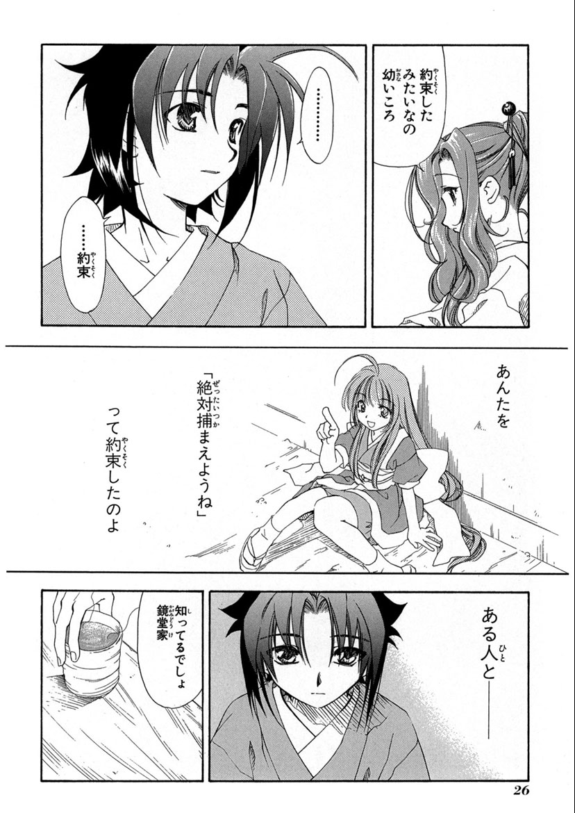
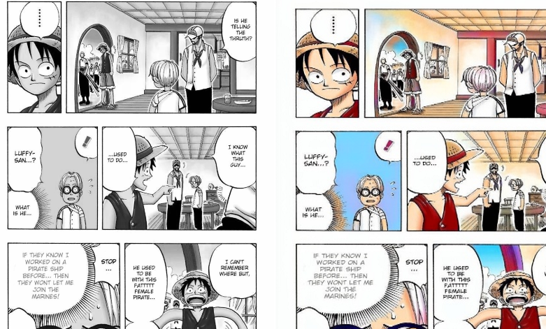
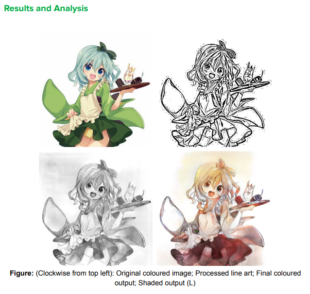

# 动画上色相关技术 / Paper / 实现考察

[1] Style2Paints & PaintsChainer

目前关于上色最流行的是两款产品，Style2Paints 和 PaintsChainer

关于 Style2Paints
- 项目首页: https://lllyasviel.github.io/
- Github: https://github.com/lllyasviel/style2paints
- Papers:
    - [Style Transfer for Anime Sketches with Enhanced Residual U-net and Auxiliary 
    Classifier GAN](https://arxiv.org/pdf/1706.03319.pdf)
    - [Two-stage Sketch Colorization](http://www.cse.cuhk.edu.hk/~ttwong/papers/colorize/colorize.pdf)

关于 PaintsChainer

// todo

[2] [Comicolorization: Semi-Automatic Manga Colorization](https://arxiv.org/abs/1706.06759)

实现：https://github.com/DwangoMediaVillage/Comicolorization by chainer / 数据集： manga109

效果：

[3] [cGAN-based Manga Colorization Using a Single Training Image](https://arxiv.org/abs/1706.06918)

实现： https://github.com/sudheerachary/Manga_Colorization

效果：

[4] https://github.com/Muks14x/CS299_22_27

